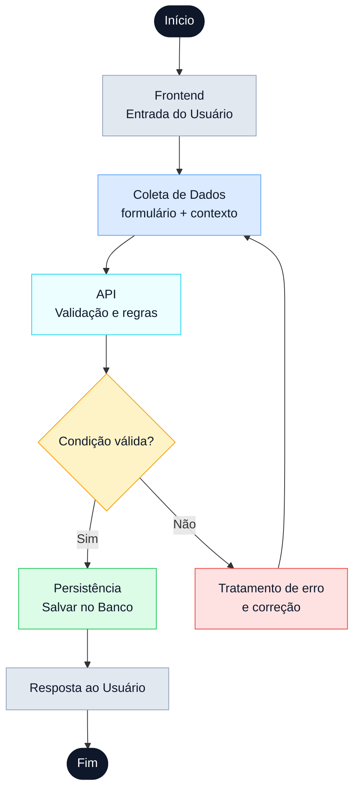

## Fluxo do Sistema

### Objetivo
Descrever o fluxo principal do sistema de **[NOME DO SISTEMA]**, desde a entrada do usuário até a finalização do processo.

### Atores
- Usuário/Cliente
- Frontend
- API
- Banco de Dados
- Operador/Admin (se existir)

### Regras principais
- [Regra 1 - um técnico precisa obter 1 skill]
- [Regra 2]
- [Regra 3]

### Fluxo principal (passo a passo)
1. O usuário inicia **[ação inicial]** no Frontend.
2. O sistema realiza **coleta de dados** (formulário, contexto e metadados).
3. A API recebe e valida **[validações]**.
4. Se **[condição]**, então **[ação]**.
5. Caso contrário, **[alternativa]**.
6. O sistema persiste os dados no **Banco de Dados**.
7. O usuário recebe **[confirmação/erro]**.

### Fluxograma

