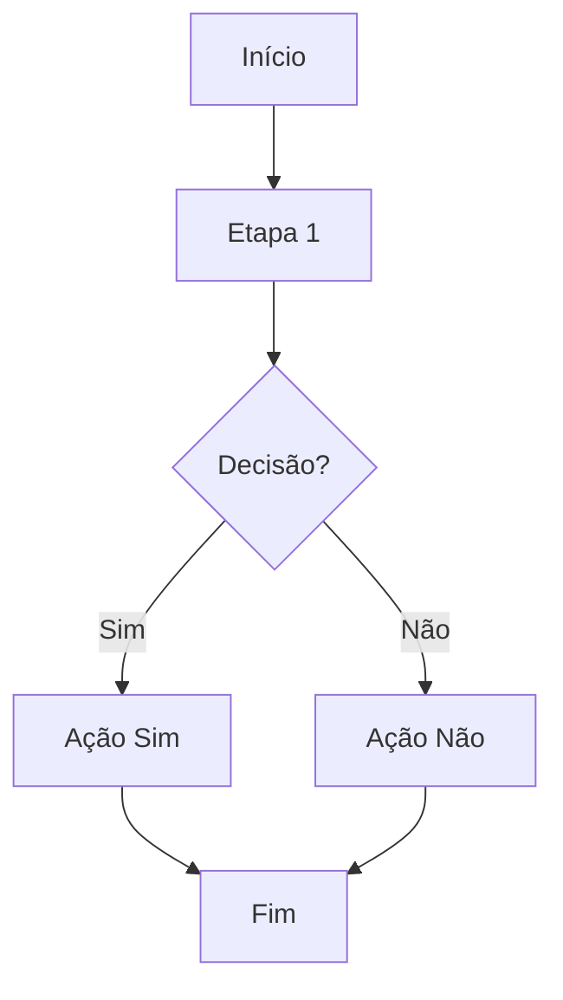

## Fluxo do Sistema

### Objetivo
Descrever o fluxo principal do sistema de **[NOME DO SISTEMA]**, desde a entrada do usuário até a finalização do processo.

### Atores
- Usuário/Cliente
- Frontend
- API
- Banco de Dados
- Operador/Admin (se existir)

### Regras principais
- [Regra 1]
- [Regra 2]
- [Regra 3]

### Fluxo principal (passo a passo)
1. O usuário inicia **[ação inicial]**
2. O sistema coleta **[dados]**
3. A API valida **[validações]**
4. Se **[condição]**, então **[ação]**
5. Caso contrário, **[alternativa]**
6. O sistema salva **[o que salva]**
7. O usuário recebe **[confirmação/erro]**

### Fluxograma

